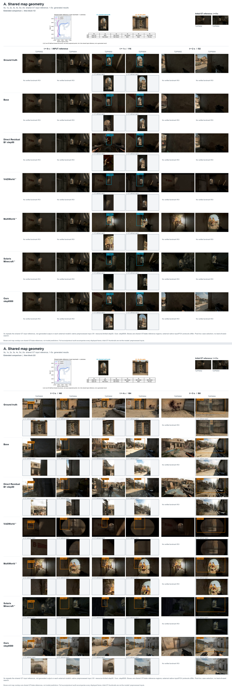
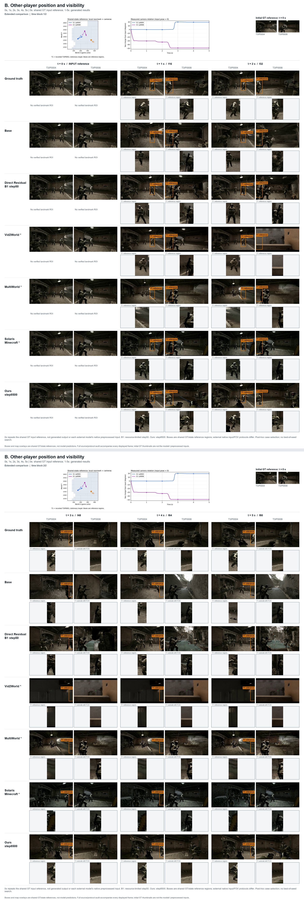
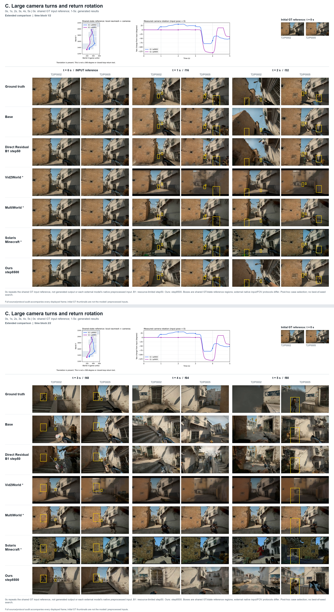

# ABC 定性对比素材 / Qualitative comparison assets

0s、1s、2s、3s、4s、5s；GT + LingBot Base + Direct Residual B1 + Vid2World + MultiWorld + Minecraft Solaris + Ours。

[下载全部原图 ZIP / Release](https://github.com/ZhengqiSun/omniscene-forge/releases/tag/qualitative-abc-20260914-v1)。下载解压后打开 `index.html`，按模型、视角和秒数取图。

包含252张无框原帧、3张完整figure、6张地图/相机位置与yaw参考图，附模型索引和参考框坐标。
0秒为共享GT输入参考，7行中的42个0秒文件对应6张独立输入图；它们不是生成结果。
完整素材的目录、参数与解释见ZIP内README；以下为便览图，完整高清图在Release。

| 组别 | 内容 | 完整原图文件 |
| --- | --- | --- |
| A | 共享地图几何 | `A_map_geometry/figures/A_all_7_methods_full.png` |
| B | 玩家位置与可见性 | `B_player_visibility/figures/B_all_7_methods_full.png` |
| C | 大转角过程 | `C_large_camera_turns/figures/C_all_7_methods_full.png` |

[全部原图 ZIP（约132 MB）](https://github.com/ZhengqiSun/omniscene-forge/releases/download/qualitative-abc-20260914-v1/qualitative_abc_7methods_20260914.zip) · [A 高清整图](https://github.com/ZhengqiSun/omniscene-forge/releases/download/qualitative-abc-20260914-v1/A_all_7_methods_full.png) · [B 高清整图](https://github.com/ZhengqiSun/omniscene-forge/releases/download/qualitative-abc-20260914-v1/B_all_7_methods_full.png) · [C 高清整图](https://github.com/ZhengqiSun/omniscene-forge/releases/download/qualitative-abc-20260914-v1/C_all_7_methods_full.png)

[模型／视角／时间索引 CSV](../../../provenance/qualitative_comparisons/abc_20260914/manifest.csv) · [JSON 清单](../../../provenance/qualitative_comparisons/abc_20260914/manifest.json)

## A

## B

## C

B1为资源受限step50；Ours为step8500。外部模型输入协议存在差异。参考框和地图/曲线不是生成结果测量；这些是事后选取的展示案例。
